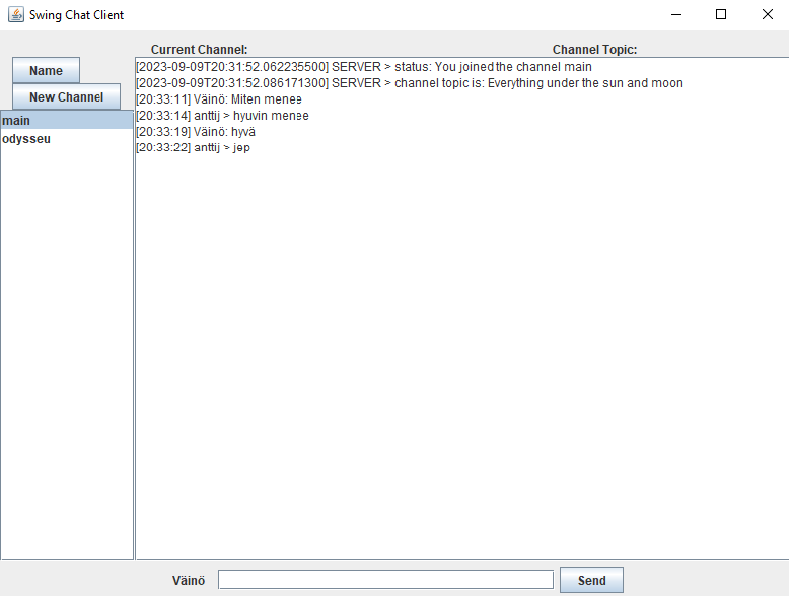

# O4 Chat Client

O4 Chat Client is a GUI chat client app for Ohjelmointi 4 (Programming 4) course. 

The client acts as an example of how to use the client side API to the [O4-server](https://github.com/anttijuu/o4-server).

This is my chat client app from programming 4 course where I implemented all the chatCLient. This application has 
Graphical user interface where you can communicate with others. It also has a bot channel where server sends text to the client. 
Here are examples of the program:

You can write messages to your friends

You can also create a new channel where you can discuss about different topics.

You can change your nickname and it sends the new nickname to the server.

The O4-server is a chat server with the following main properties:

* Clients connect to the server using a TCP socket.
* There is no authentication of users, just connect and start chatting.
* User nick's are not (unfortunately) verified; several users can thus have the same nick. This may cause issues. Feel free to improve the server.
* The chat messages are not saved nor buffered on the server side, so you cannot view old messages, sent before the client connected.
* The server supports chat *channels* you can join. Only clients on the same channel can view messages sent to the channel.
* Each channel can have a topic any user may change.
* You can reply to a specific chat message. How this is done, is client implementation specific. This console client does not support this, at the moment.
* You can send *private messages* to a specific user using their nick. Note that the user must send at least one message; otherwise the server does not know the nick of the user and cannot forward any private messages to the user.
* You can join a server side bot channel if server is configured to have one. A bot channel reads messages from a text file and posts those periodically to the channel. This can be used to test clients and how they are able to receive messages from the server.

## Dependencies

The following are needed to build and run the client:

* JDK 18 or later.
* Maven for building and packaging the executable.
* JSON library (see details from pom.xml, Maven will download and install this when building).
* JColor for color output (optional, off by default, Maven will download and install this when building).
* An IDE if you wish to view and/or edit the code (e.g. Visual Studio Code with Java extensions, or Eclipse).

The client app is structured as described in this high level UML class diagram:

* `ChatClient` is the command line UI for the app, running the show.
*  `ChatClient` uses the `ChatTCPClient` to connect to and send/receive messages with the remote ChatServer. `ChatTCPClient` listens to messages from the server and converts them from JSON to `Message` objects, passing them then to `ChatClient` for handling.
* An abstract `Message` class forms the basis for all types of messages. Any `Message` can convert itself to a JSON String using the method `toJSON()`.
* `ChatMessage`s are the actual chat messages users sent to and received from the server to talk with each others.
* `ChangeTopicMessage` is used to request channel topic change as well as received by the client when the channel topic changes.
* `JoinMessage` is used by the client when it wants to join an existing channel or open a new channel.
* `ListChannelsMessage` can be sent by the client when user wishes to view available channels. It is also sent by the server as a reply, containing the currently open channels.
* `StatusMessage` is a message server can use to tell clients about interesting events happening in the server.
* `ErrorMessage` is used by the server when something goes wrong in the server side or client has sent an erroneus request. It can also contain a flag to instruct the client to shut down when the server is itself shutting down.
* `MessageFactory` can be used to create `Message` objects from the JSON received from the server.
* `ChatTCPClient` does not directly use `ChatClient`, but accesses it using the callback interface class `ChatClientDataProvider`. When the TCP client needs the settings (nick, server address, etc.), it asks these from the client using this interface the `ChatClient` implements.

Important things to be aware of:

* **Note 1**: Not all details of the implementation are visible in this diagram.
* **Note 2**: The `ChatTCPClient` **must be executed in a thread**. `ChatTCPClient` calls *blocking* network functions to read and send data over the TCP socket. If you run the `ChatTCPClient` on the main thread of the application, this effectively blocks the GUI of the application. For an example on how to do this, see lines 99-100 in `ChatClient.java`.
* **Note 3**: If you want to have several *separate* sessions to a server (e.g. using a different nick), or separate sessions to *different* servers, just create one `ChatTCPClient` for each of these connections. You will most probably also want to have different implementations of `ChatClientDataProvider` interface for these `ChatTCPClient` instances.
* **Note 4**: This command line client *does not support* the reply-to chat messages. UI does not provide any means to reply to a specific previous received message. Nor does the UI show if an incoming message is a reply to a previous sent or received message.

## Building the client

Build the client from command line:

`mvn package`

You should then have a subdirectory `target` including .jar files for running the client (see below).

If there are errors, check out the error output and sort out the issues.

You can also build and run the client from an IDE, e.g. Visual Studio Code or Eclipse (see below).

Windows Command prompt does not by default support UTF-8, so any special chars may end up not transferring properly. Prefer using the new Windows Terminal which does support UTF-8, or even better, use a proper terminal app such as Terminus (Win/Linux/macOS) or iTerm (macOS).

